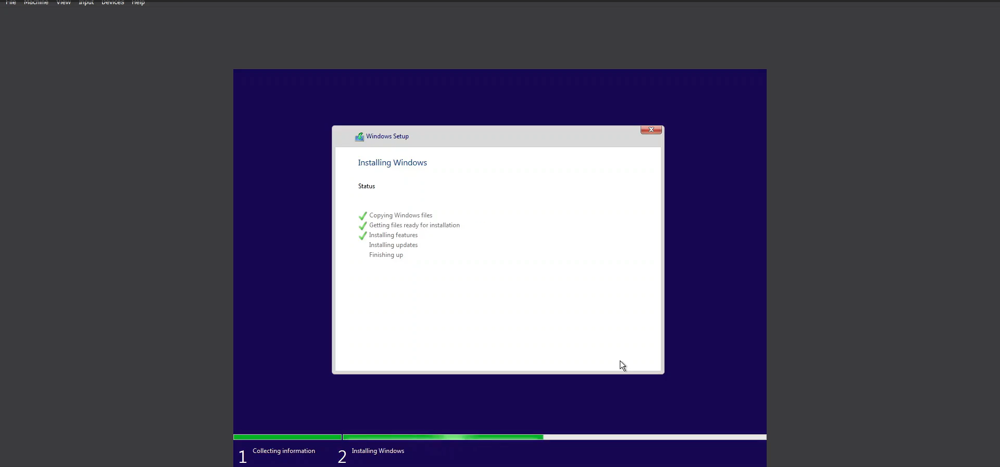
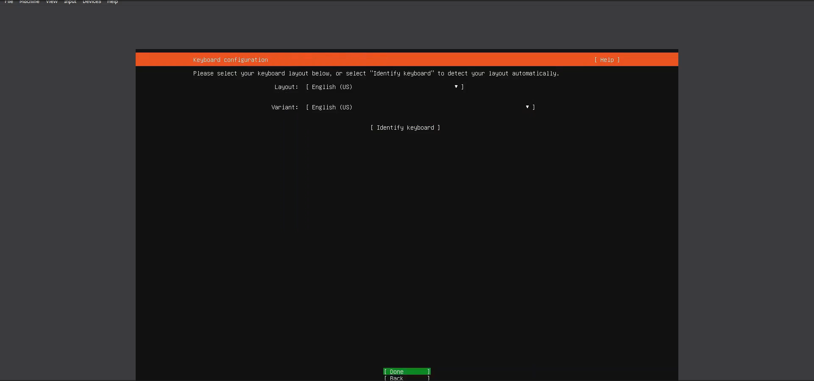
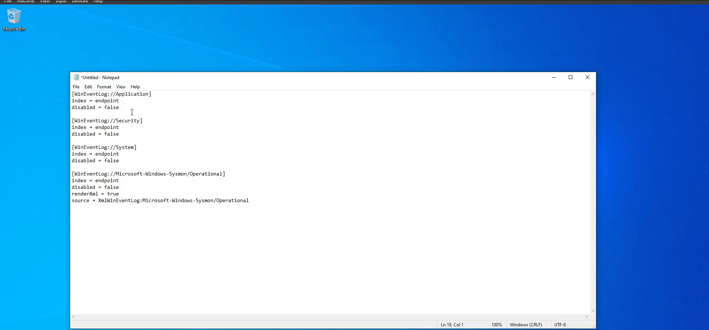
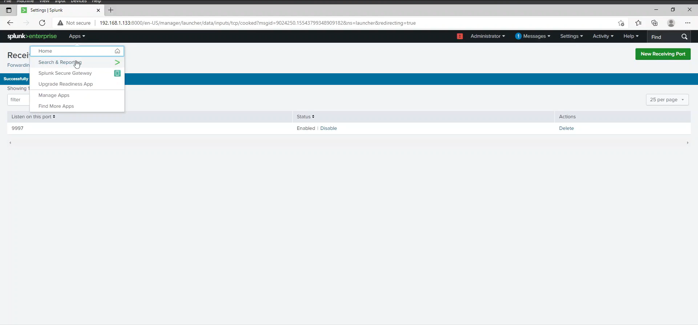
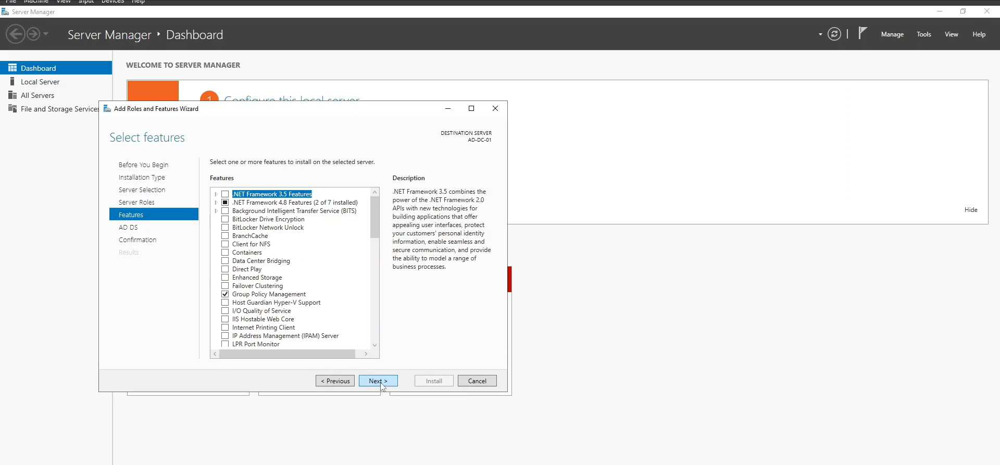
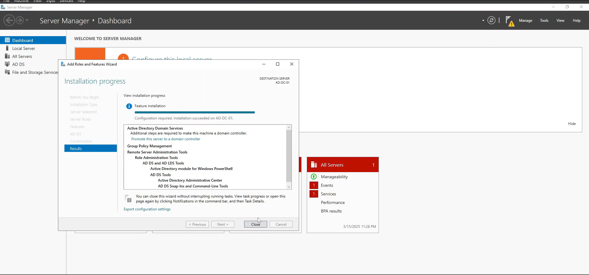
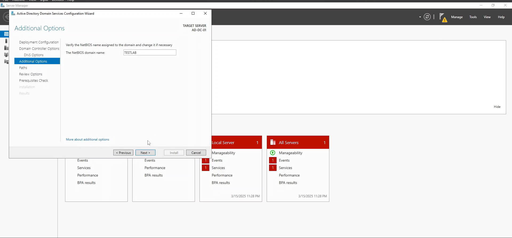
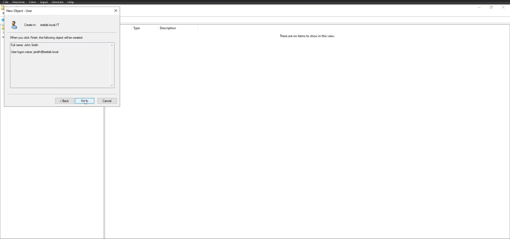
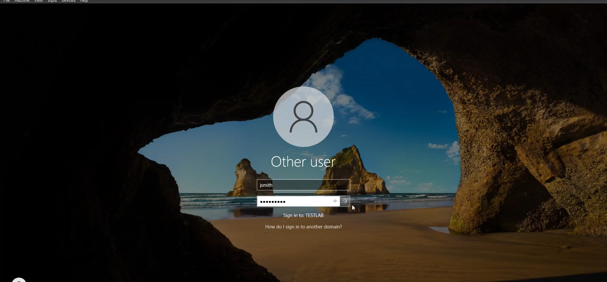
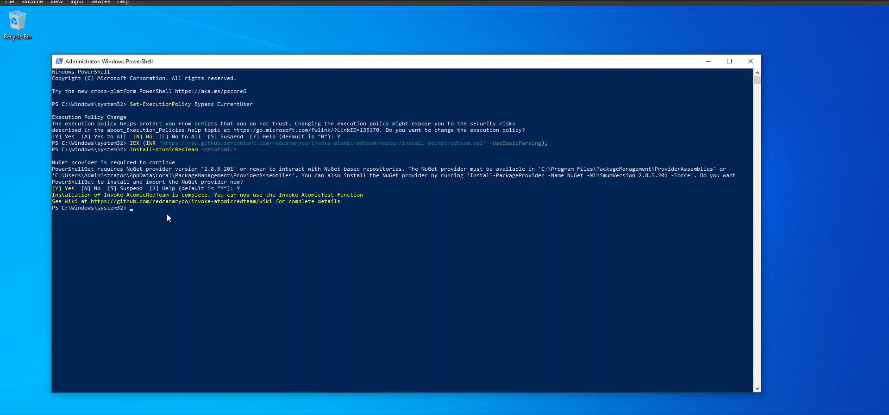

# **Active Directory and Splunk Cybersecurity Lab**

## **Project Overview**  
The purpose of this project is to integrate **Active Directory (AD)** with **Splunk** for efficient security monitoring and threat detection. The setup involves **Windows Server 2022, Windows 10, Ubuntu Server**, and key security tools such as **Sysmon, Atomic Red Team, and Splunk** to simulate real-world attack scenarios and analyze security events.

## **Architecture Diagram**  
### Components Involved:
1. **Windows Server 2022** – AD Domain Controller (DC)
2. **Windows 10** – Client machine (part of AD domain)
3. **Ubuntu Server** – Splunk Enterprise / Server
4. **Splunk** – Security Information and Event Management (SIEM)
5. **Sysmon** – System Monitoring to log critical events
6. **Atomic Red Team** – Simulates adversarial techniques for testing defenses

## **Installation & Configuration Guide**  
### **1. Setting Up Active Directory (AD) on Windows Server 2022**  
1. Install Active Directory Domain Services (AD DS).
2. Configure the domain (e.g., 'testlab.local').
3. Add a Windows 10 machine to the AD domain.
4. Set up **Group Policies (GPOs)** for security enhancements.

### **2. Installing and Configuring Splunk**  
1. Download and install **Splunk Enterprise** on Ubuntu Server.
2. Configure Splunk **forwarders** on Windows Server 2022 and Windows 10 to collect logs.
3. Create Splunk **data inputs** for Active Directory event logs.

### **3. Deploying Sysmon for Enhanced Logging**  
1. Install **Sysmon** on both Windows Server and Windows 10 clients.
2. Configure a robust **Sysmon configuration file** (such as [SwiftOnSecurity's config](https://github.com/SwiftOnSecurity/sysmon-config)).
3. Verify that Sysmon logs critical security events (process creation, file access, registry modifications).

### **4. Using Atomic Red Team for Adversary Simulation**  
1. Install **Atomic Red Team** (`Invoke-Atomic` PowerShell module).
2. Run specific attack simulations (e.g., **Privilege Escalation, Credential Dumping**).
3. Validate logs in **Splunk** to check for detections.

### **5. Analyzing Logs & Building Dashboards in Splunk**  
1. Query logs for **failed login attempts, privilege escalation, persistence mechanisms**.
2. Develop **Splunk dashboards** for real-time monitoring.
3. Create **correlation searches** to detect suspicious activities.

## **Testing & Validation**  
- Perform **login brute-force attacks** and check logs.
- Simulate **malicious PowerShell executions** and ensure they are logged.
- Validate that Splunk **alerts** trigger on **suspicious activities**.

## **Conclusion**  
This project demonstrates how to integrate **Active Directory with Splunk** for effective cybersecurity monitoring. By utilizing **Sysmon and Atomic Red Team**, SOC analysts can **simulate attacks, analyze threats, and improve defenses** in a Windows environment.

## *Walkthrough | Screenshots*

**Installing Windows Server 2022**

             

**Installing Windows 10**

             

**Ubuntu Server 24.04.1 Installation**

              

**Splunk Installation**

        

**Splunk Universal Forwarder/Sysmon Installation**

            

**Splunk Configuration**

            

**Active Directory Configuration/Installing Active Directory Domain Services/Joining Windows 10 to a Domain**

                                             

**Atomic Red Team Installation**

   

**MITRE ATT&CK FRAMEWORK**

 

**Running Atomic Red Team Tests/Viewing Logs_Alerts in Splunk**

    

